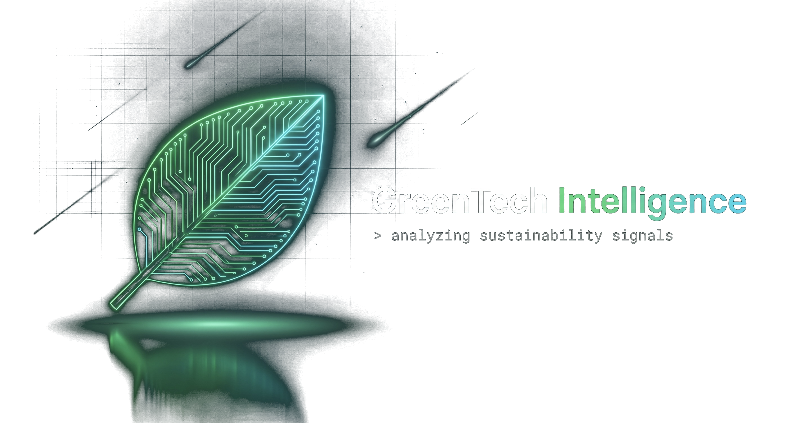

<div align="center">



# GreenTech Intelligence

**Plateforme web d'analyse et de classification automatique d'articles tech selon leur pertinence Green IT.**

[](https://www.python.org/)
[](https://fastapi.tiangolo.com/)
[](https://react.dev/)
[](https://pytorch.org/)
[](https://www.docker.com/)
[](LICENSE)

</div>

---

## ✨ En bref

GreenTech Intelligence collecte des articles tech depuis **6 sources actives** (Guardian, Dev.to, arXiv, Crossref, TechCrunch Climate, 4 sites Green IT FR), les nettoie via Spark, et applique une **classification hybride à deux étages** :

1. **Pré-filtre mots-clés permissif** → écarte les articles manifestement non-Green
2. **LLM judge** (`Qwen3-4B-Instruct-2507` via API HuggingFace, fallback local sur GPU AMD ROCm) → tranche les borderline

Un **classifieur Qwen3-4B + LoRA TIES** fine-tuné sur le golden dataset (13 111 articles bilingues EN/FR) sert ensuite l'inférence temps-réel via une **file d'attente Celery + Redis**.

### Champion de production

| Métrique (K-fold honnête, σ MCC = 0.010) | Valeur |
|---|---|
| **MCC** | **0.6238** |
| F1 / Recall / Precision | 0.6861 / 0.8913 / 0.5573 |
| Latence p50 (GPU ROCm) | **60 ms** |
| Latence p50 (CPU Docker) | ~13 s |
| VRAM peak | 7.7 GB |
| Modèle | `Qwen/Qwen3-4B` (Apache-2.0) + LoRA all-linear, r=16, α=32 |
| Ensemble | TIES (Yadav NeurIPS 2023) sur 3 folds top-1 K=3×2 |

Détail complet → [`docs/MODEL_CARD.md`](docs/MODEL_CARD.md) · [`docs/SELECTION_CHAMPION_2026-04.md`](docs/SELECTION_CHAMPION_2026-04.md)

---

## 🧱 Stack technique

| Couche | Outils |
|---|---|
| **Data (E1)** | httpx · feedparser · Scrapy 2.11+ · Playwright 1.40+ · PySpark 3.5+ · SQLAlchemy 2.0 async · asyncpg · PostgreSQL 15 · MinIO (S3) |
| **IA (E2/E3)** | PyTorch 2.9 + ROCm 7.2.1 · Transformers 4.36+ · PEFT 0.7+ · scikit-learn · Deepchecks · CodeCarbon · MLflow 2.10+ · DVC 3.40+ |
| **Backend (E4)** | FastAPI 0.109+ · Uvicorn · Pydantic 2.5+ · fastapi-users · Loguru · prometheus-client · pypdf · python-docx |
| **Queue** | Celery 5.4+ (broker + result backend Redis 5.0+) |
| **Frontend (E4)** | React 19 · Vite 8 · TypeScript 6 · Tailwind CSS v4 · shadcn/ui · Recharts · Motion · Lucide |
| **Observabilité (E5)** | Prometheus · Alertmanager · Loki + Promtail · Grafana · Pushgateway · cAdvisor |
| **DevOps** | Docker Compose · GitHub Actions · Render |

---

## 🏗️ Architecture

```
┌──────────┐   POST /analyze    ┌────────┐    consume    ┌─────────────┐
│ Frontend │ ─────────────────▶ │ API    │ ────────────▶ │ Worker      │
│ React    │                    │FastAPI │   (Redis)     │ Celery+GPU  │
└────┬─────┘ ◀── GET /{job_id} ─┴────────┘ ◀────────────┴──────┬──────┘
     │                                                          │
     │            ┌──────────────────────────────────┐          │
     └───────────▶│ Postgres · MinIO · MLflow        │◀─────────┘
                  │ Prometheus · Loki · Grafana      │
                  └──────────────────────────────────┘
```

Trois modes d'exécution :

| Mode | Usage cible | Performance |
|---|---|---|
| **Full Docker** (`--profile full`) | Démo / soutenance / CI | ~13 s/article (CPU) |
| **Hybride** (infra Docker + worker local) | Dev quotidien Windows + GPU AMD | **~800 ms/article (ROCm)** |
| **Tout local** | Dev pur sans Docker | identique au hybride |

> Le passthrough GPU AMD n'est **pas supporté par WSL2/Docker Desktop Windows** : utiliser le mode hybride pour bénéficier de la RX 7900 XTX.

---

## 🚀 Quick start

### Prérequis

| Outil | Version | |
|---|---|---|
| Python | **3.12** | <https://www.python.org/downloads/> |
| Node.js | 20 LTS | <https://nodejs.org/> |
| UV (Astral) | latest | `irm https://astral.sh/uv/install.ps1 \| iex` (Windows) |
| Docker Desktop | 4.x | <https://www.docker.com/products/docker-desktop/> |
| Git | 2.40+ | <https://git-scm.com/downloads> |

### 1. Cloner + configurer

```bash
git clone https://github.com/KaRn1zC/greentech-intelligence.git
cd greentech-intelligence
cp .env.example .env  # remplir HUGGINGFACE_TOKEN, GUARDIAN_API_KEY, JWT_SECRET_KEY
uv sync                       # backend (deps Python)
cd frontend && npm install    # frontend
```

### 2. Démarrer

**Mode Full Docker** (le plus simple) :
```bash
docker compose --profile full up -d --build
```
| Service | URL |
|---|---|
| Frontend | <http://localhost:80> |
| API Swagger | <http://localhost:8000/docs> |
| Grafana (admin/admin123) | <http://localhost:3000> |
| MLflow | <http://localhost:5000> |
| MinIO Console (minioadmin/minioadmin123) | <http://localhost:9001> |

**Mode Hybride** (recommandé pour GPU AMD ROCm) :
```bash
docker compose up -d                                                     # infra seule
uv run uvicorn src.greentech.api.main:app --reload --port 8000          # API locale
uv run celery -A greentech.api.celery_app worker --pool=solo            # worker GPU
cd frontend && npm run dev                                               # frontend Vite HMR
```

### 3. Récupérer le modèle de production

Le modèle Qwen3-4B TIES merged (8 GB) est versionné via DVC vers MinIO :
```bash
uv run dvc pull models/production.dvc
```

---

## 🌐 API REST

| Méthode | Endpoint | Auth | Description |
|---|---|---|---|
| `POST` | `/auth/register` | ❌ | Créer un compte |
| `POST` | `/auth/login` | ❌ | Login (retourne JWT) |
| `POST` | `/auth/logout` | ✅ | Déconnexion |
| `GET` | `/auth/me` | ✅ | Profil utilisateur |
| `POST` | `/analyze` | ✅ | Analyser une URL ou un texte → `job_id` (202 immédiat) |
| `POST` | `/analyze/file` | ✅ | Analyser un fichier (.txt/.md/.pdf/.docx/.html, ≤10 Mo) |
| `GET` | `/analyze/{job_id}` | ✅ | Statut & résultat du job |
| `GET` | `/articles` | ❌ | Liste paginée (filtres : `page`, `limit`, `is_green_it`, `source_id`, `date_from/to`) |
| `GET` | `/articles/search` | ❌ | Recherche full-text |
| `GET` | `/articles/{id}` | ❌ | Détail article |
| `GET` | `/stats` | ❌ | Statistiques globales |
| `GET` | `/stats/daily` | ❌ | Statistiques quotidiennes |
| `GET` | `/stats/sources` | ❌ | Statistiques par source |
| `GET` | `/health` | ❌ | Health check |
| `GET` | `/metrics` | ❌ | Métriques Prometheus (HTTP + métier) |

Documentation interactive : `/docs` (Swagger) · `/redoc` (ReDoc).

---

## 🧠 Pipeline d'entraînement

Le pipeline complet (collecte → annotation → classification → résumés → K-fold → promotion) est orchestré par un script unique :

```bash
uv run python scripts/retrain_pipeline.py
```

Étapes individuelles :
```bash
uv run python scripts/retrain_pipeline.py collect       # 6 sources : Guardian, Dev.to, arXiv, Crossref, TechCrunch, sites Green IT FR
uv run python scripts/retrain_pipeline.py clean         # supprime contenus < 50 chars
uv run python scripts/retrain_pipeline.py summarize-classif   # résumé feature d'entraînement (450 tokens)
uv run python scripts/retrain_pipeline.py annotate      # étage 1 : pré-filtre mots-clés
uv run python scripts/retrain_pipeline.py classify      # étage 2 : LLM judge Qwen
uv run python scripts/retrain_pipeline.py summarize-green     # résumé écologique (Green IT confirmés)
uv run python scripts/retrain_pipeline.py export-golden       # data/golden_dataset.csv
uv run python scripts/retrain_pipeline.py augment       # back-translation EN↔FR (opus-mt)
uv run python scripts/retrain_pipeline.py train-cv --model=qwen3      # K=3×2 ~6h sur RX 7900 XTX
uv run python scripts/retrain_pipeline.py train-cv --model=mdeberta   # K=5×3 challenger
uv run python scripts/retrain_pipeline.py benchmark-models            # comparatif champion vs challenger
uv run python scripts/retrain_pipeline.py auto-promote                # promotion conditionnelle
```

**Critères de promotion composites** (`models/best_metrics.json`) :
1. `MCC_nouveau >= MCC_ancien - 0.01` (métrique principale, robuste au déséquilibre)
2. `Recall_Green_IT >= 0.5` (garde-fou métier)
3. `F1_nouveau >= F1_ancien × 0.95` (non-régression)
4. `σ(MCC) entre folds <= 0.15` (stabilité K-fold)

---

## 🧪 Tests & qualité

```bash
# Backend
uv run pytest tests/ -v --cov=src/greentech
uv run ruff check src/ scripts/ tests/ --fix
uv run ruff format src/ scripts/ tests/

# Frontend
cd frontend
npm run type-check        # TypeScript strict
npm run lint              # ESLint v9
npm run test:a11y         # Playwright + Axe-core (WCAG 2.1 AA)
npm run build             # build prod Vite

# Documentation Sphinx
cd docs && uv run sphinx-build -b html . _build/html

# Smoke tests
uv run python scripts/smoke_e2e_analyze.py    # API + Celery + 10 analyses
uv run python scripts/smoke_train_cv.py --model qwen3   # mini K=2×1 (20 min)
```

CI/CD GitHub Actions : [`.github/workflows/ci.yml`](.github/workflows/ci.yml) (lint + tests + pip-audit) · [`.github/workflows/cd.yml`](.github/workflows/cd.yml) (déploiement Render).

---

## 📚 Documentation

| Document | Contenu |
|---|---|
| [`docs/MODEL_CARD.md`](docs/MODEL_CARD.md) | Carte modèle Qwen3-4B TIES v2.0 (méthodologie, métriques, limites, biais) |
| [`docs/BENCHMARK_BRUT_2026-04.md`](docs/BENCHMARK_BRUT_2026-04.md) | Baseline rigoureuse pré-entraînement (linear probing + zero-shot NLI) |
| [`docs/BENCHMARK_FINAL_2026-04.md`](docs/BENCHMARK_FINAL_2026-04.md) | Benchmark post-entraînement Qwen3-4B vs mDeBERTa-v3-base |
| [`docs/CHOIX_DEBERTA.md`](docs/CHOIX_DEBERTA.md) | Justification du challenger mDeBERTa-v3-base |
| [`docs/SELECTION_CHAMPION_2026-04.md`](docs/SELECTION_CHAMPION_2026-04.md) | Critères de sélection + verdict champion |
| [`docs/SPECIFICATIONS_DATA.md`](docs/SPECIFICATIONS_DATA.md) | Inventaire 6 sources + pipeline collecte |
| [`docs/SPECIFICATIONS_TECHNIQUES.md`](docs/SPECIFICATIONS_TECHNIQUES.md) | Architecture technique détaillée |
| [`docs/REGISTRE_RGPD.md`](docs/REGISTRE_RGPD.md) | Traitement données personnelles (RGPD Art. 30) |
| [`docs/PLAYBOOK_MAINTENANCE.md`](docs/PLAYBOOK_MAINTENANCE.md) | Diagnostic incidents production |
| [`docs/PROCEDURE_MAJ_MODELE.md`](docs/PROCEDURE_MAJ_MODELE.md) | Procédure de promotion d'un nouveau modèle |
| [`docs/PROCEDURE_MAJ_ROCM.md`](docs/PROCEDURE_MAJ_ROCM.md) | Migration ROCm (Windows wheels-only) |
| [`docs/ACCESSIBILITE_DOCUMENTATION.md`](docs/ACCESSIBILITE_DOCUMENTATION.md) | Conformité WCAG 2.1 AA |
| [`docs/PLAN_ETAPES.md`](docs/PLAN_ETAPES.md) · [`docs/CHECKLIST_SUIVI.md`](docs/CHECKLIST_SUIVI.md) | Feuille de route + validation compétences E1-E5 |

---

## 📂 Structure du projet

```
greentech-intelligence/
├── src/greentech/                  # Backend Python 3.12
│   ├── config.py                   # Pydantic Settings (PostgreSQL, MinIO, Redis, HF, JWT, Celery)
│   ├── data/{collectors,processors,storage}/   # Collecte + Spark + SQLAlchemy
│   ├── ai/
│   │   ├── services/               # summarizer, classifier_llm, llm_dispatcher (HF + fallback local)
│   │   ├── models/                 # training (Qwen3Classifier, MDeBERTaClassifier), inference, classifier
│   │   └── mlops/                  # tracking (MLflow), carbon (CodeCarbon), calibration, robustness
│   └── api/
│       ├── main.py                 # FastAPI + Prometheus instrumentator
│       ├── celery_app.py + tasks.py    # Queue Celery + Redis
│       ├── routes/                 # auth, analyze, articles, stats
│       └── schemas/, security/     # Pydantic + JWT
├── frontend/                       # React 19 + Vite 8 + TS 6 + Tailwind v4
│   ├── src/{components,pages,hooks,lib}/
│   └── tests/                      # Playwright + Axe-core
├── tests/                          # pytest (api, unit/ai, unit/data)
├── scripts/                        # 16 scripts CLI (retrain_pipeline, benchmark, smoke tests, helpers)
├── models/                         # Modèle production (DVC → MinIO)
│   ├── production/                 # Qwen3-4B TIES merged (8 GB, ensemble_config.json + calibration)
│   └── qwen3/{folds,folds_ties}/   # 6 adapters K=3×2 (re-fusion possible)
├── docs/                           # Sphinx + 21 documents projet
├── config/{prometheus,alertmanager,loki,grafana}/   # Monitoring stack
├── audit_{crossref,greenit}/       # Audit Phase 2 (traçabilité)
├── data/                           # golden_dataset*.csv (DVC) + fixtures test
├── docker-compose.yml              # 15 services
├── Dockerfile.api · Dockerfile.mlflow
├── pyproject.toml · uv.lock        # Deps Python via UV
├── render.yaml                     # Déploiement Render
└── .github/workflows/{ci,cd}.yml   # CI/CD GitHub Actions
```

---

## 🌍 Déploiement (Render)

Déploiement automatique via [`render.yaml`](render.yaml) :

1. Lier le dépôt GitHub à Render
2. **Blueprints** > **New Blueprint Instance** → détection automatique
3. Renseigner les secrets : `HUGGINGFACE_TOKEN`, `GUARDIAN_API_KEY`, `JWT_SECRET_KEY`
4. Chaque push sur `main` déclenche CI → CD (tests OK → déploiement)

---

## 📄 Licence

[MIT](LICENSE) · Modèle de base [`Qwen/Qwen3-4B`](https://huggingface.co/Qwen/Qwen3-4B) sous licence Apache-2.0.

## 👤 Auteur

**Arnaud "KaRn1zC" BOY** · Projet de mémoire — Titre Professionnel de niveau 6, Développeur en Intelligence Artificielle et Data Analyst (2025-2026).
